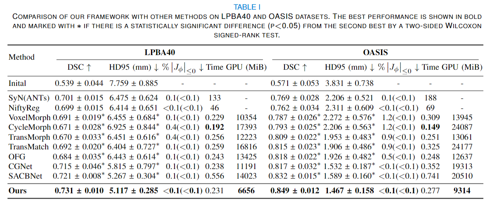
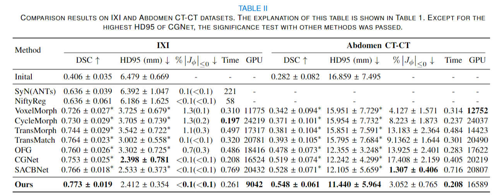
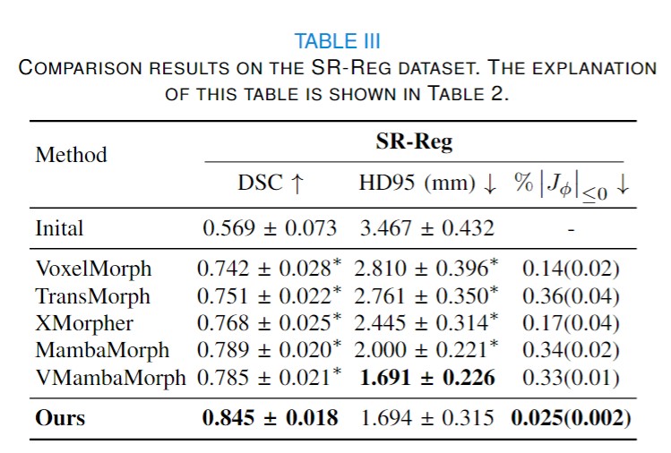

# Efficient Multi-Task Medical Image Registration via Perceiving Polarity Correlation
This is the official pytorch implementation of the paper 'Efficient Multi-Task Medical Image Registration via Perceiving Polarity Correlation'.

The paper is currently under review, and more details will be disclosed once it is accepted.


# 🧩 Requirements

- A Python environment with dependencies from `requirements.txt`
- A CUDA-capable GPU and a CUDA-enabled PyTorch build


# 🚀 Quick Start

1) Installation environment

```
pip install -r requirements.txt
```

2) Dataset preparation

Before running the commands, please ensure that the dataset has been correctly placed. 

Taking the example of running the sample code on the OASIS dataset, ensure that the OASIS dataset is placed under `../Datasets/OASIS/`. This will ensure that the code can run directly without encountering any path-related errors. 

OASIS dataset acquisition link:    [🔗 OASIS-dataset](https://drive.google.com/file/d/1UjKToVDdlRs3dqxbo8ytn8GKt71NGpVA/view?usp=drive_link)

(Here, `./` refers to the directory path where `Train_OASIS.py` and `Infer_OASIS.py` are located.)

3) Preload model weights

Model weights need to be placed under the path `./Checkpoint/OASIS/` 

Model weights can be downloaded from the following link:    [🔗OASIS-weights](https://drive.google.com/file/d/1pTqDG7_BrGG_64I9oiAxbZ9th1Kx92iN/view?usp=drive_link)


# ⛳ Train and Infer

```
cd ./PLCReg/
```

For Linux:

Train

```
python Train_OASIS.py
```

Infer 

```
python Infer_OASIS.py
```

**configs:** The datasets path or hyper parameter settings required to run the code can be configured under this path file: `./utils/config.py`


# 💡 Main Contributions

- **Polarity Correlation Attention (PoLaCA) :** PoLaCA explicitly decomposes correlation-aware into positive and negative correlations, restoring inhibitory cues that suppress mismatched regions.
- **Adaptive Learning System (ALS) :** ALS evaluates the correlation contribution of each channel and sharpens the attention distribution, concentrating it on registration-critical regions.
- **State-of-the-Art Performance:** Validated on 5 datasets with superior accuracy and robustness. 


# 🖌 Network Architecture  

## Overview

The framework employs dual-stream encoders to extract multi-scale features from the moving image $I^{m}$ and the fixed image $I^{f}$, together with a coarse-to-fine deformation estimator that progressively generates the registration field.


**Polarity Correlation Attention (PoLaCA) and Adaptive Learning System (ALS)**


# 📝 Performance

## Single Modal Registration

### Atlas-Based Registration

LPBA40, OASIS, IXI datasets



### Inter-Subject Registration

Abdomen CT-CT dataset




## Multi-Modal Inter-Subject Registration

SR-Reg dataset



## P-Value Analysis


# 🗳 Data Description

We evaluate our model on five benchmark datasets with rigorous data partitioning protocols to ensure reproducibility and fair comparison:

### Dataset Name: LPBA40

Size: 40 T1-weighted MRI scans (160×192×160)

**Split:** 30 training cases / 9 testing cases /  1 case used as an atlas 

Label: 54 anatomical labels

### Dataset Name: OASIS

Size: 414 brain  MRI scans (160×224×192)

**Split:** 394 training cases / 19 testing cases /  1 case used as an atlas 

Label: 35 anatomical labels

### Dataset Name: IXI

Size: 576 T1-weighted brain MRI scans (160×192×224)

**Split:** 403 training cases / 58 validation  cases / 115 testing cases 

Label: 30 anatomical labels

### Dataset Name: Abdomen CT-CT

Size: 30 abdominal CT scans (224×160×192)

**Split:** 20 training cases (20×19 pairs)  / 10 testing cases (10×9 pairs)

Label: 13 anatomical labels

### Dataset Name: SR-Reg

Size: 180 paired CT–MR volumes (176×208×192)

**Split:** 150 training cases (150×149 pairs)  / 30 testing cases (30×29 pairs)

Label: 16 anatomical labels


**The directory structure of the dataset is as follows:**

```
Datasets
├── OASIS
│   ├── fixed.nii.gz
│   ├── Train
│   │   ├── OASIS_0001_0000.nii.gz
│   │   ├── OASIS_0002_0000.nii.gz
│   │   ├── ...
│   ├── Test
│   │   ├── OASIS_0396_0000.nii.gz
│   │   ├── OASIS_0397_0000.nii.gz
│   │   ├── ...
│   ├── label
│   │   ├── OASIS_0001_0000.nii.gz
│   │   ├── OASIS_0002_0000.nii.gz
│   │   ├── ...
├── LPBA40_delineation
│   ├── delineation_l_norm
│   │   ├── fixed.nii.gz
│   │   ├── train
│   │   │   ├── S11.delineation.skullstripped.nii.gz
│   │   │   ├── S12.delineation.skullstripped.nii.gz
│   │   │   ├── ...
│   │   ├── test
│   │   │   ├── S02.delineation.skullstripped.nii.gz
│   │   │   ├── S03.delineation.skullstripped.nii.gz
│   │   │   ├── ...
├── IXI_data
│   ├── atlas.pkl
│   ├── Train
│   │   ├── subject_0.pkl
│   │   ├── subject_4.pkl
│   │   ├── ...
│   ├── Test
│   │   ├── subject_1.pkl
│   │   ├── subject_3.pkl
│   │   ├── ...
│   ├── Val
│   │   ├── subject_2.pkl
│   │   ├── subject_5.pkl
│   │   ├── ...
├── AbdomenCTCT
│   ├── imagesTr
│   │   ├── AbdomenCTCT_0001_0000.nii.gz
│   │   ├── AbdomenCTCT_0002_0000.nii.gz
│   │   ├── ...
│   ├── imagesTs
│   │   ├── AbdomenCTCT_0021_0000.nii.gz
│   │   ├── AbdomenCTCT_0022_0000.nii.gz
│   │   ├── ...
│   ├── labelsTr
│   │   ├── AbdomenCTCT_0001_0000.nii.gz
│   │   ├── AbdomenCTCT_0002_0000.nii.gz
│   │   ├── ...
├── SR-REG
│   ├── seg
│   │   ├── 1BA001.nii.gz
│   │   ├── 1BA005.nii.gz
│   │   ├── ...
│   ├── vol
│   │   ├── 1BA001_ct.nii.gz
│   │   ├── 1BA001_mr.nii.gz
│   │   ├── 1BA005_ct.nii.gz
│   │   ├── 1BA005_mr.nii.gz
│   │   ├── ...

```


# 📊 Visualization（&Supplement）


### LPBA40 Dataset


### OASIS Dataset


### IXI Dataset


### Abdomen CT-CT Dataset


### SR-Reg Dataset


# 🔑 Acknowledgements

We sincerely acknowledge the [TransMatch](https://github.com/tzayuan/TransMatch_TMI), [CGNet](https://github.com/scu1996cy/CGNet) and [SACBNet](https://github.com/x-xc/SACB_Net) projects.